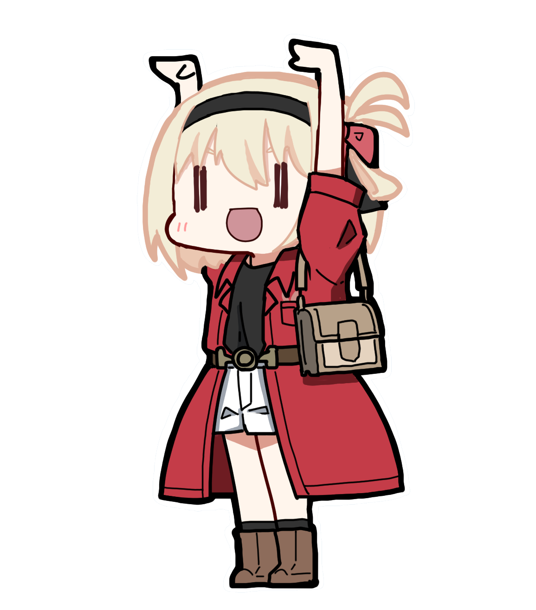
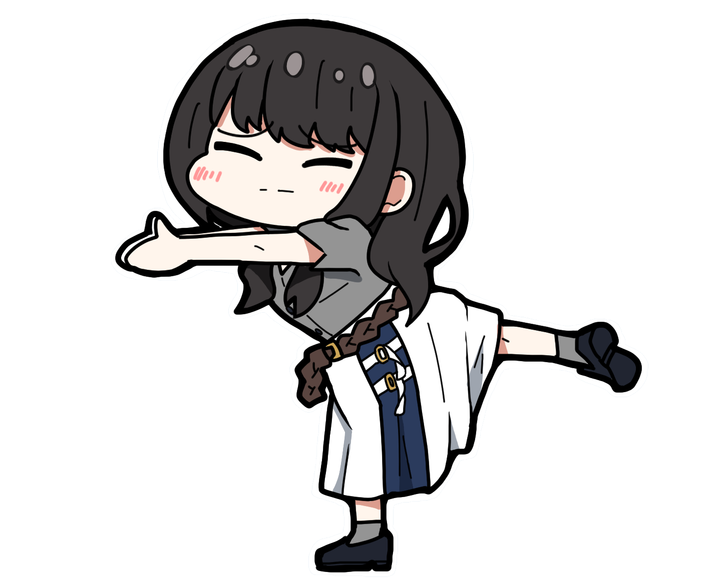
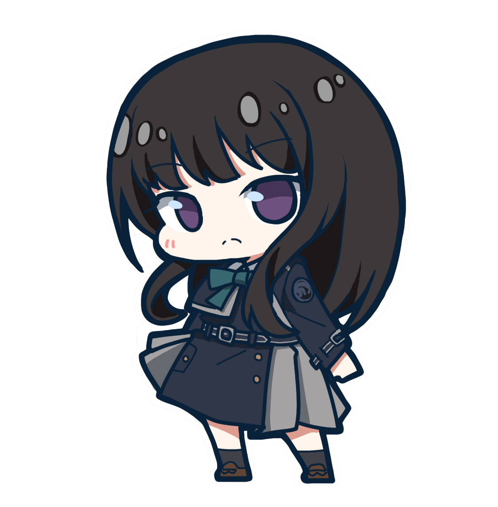
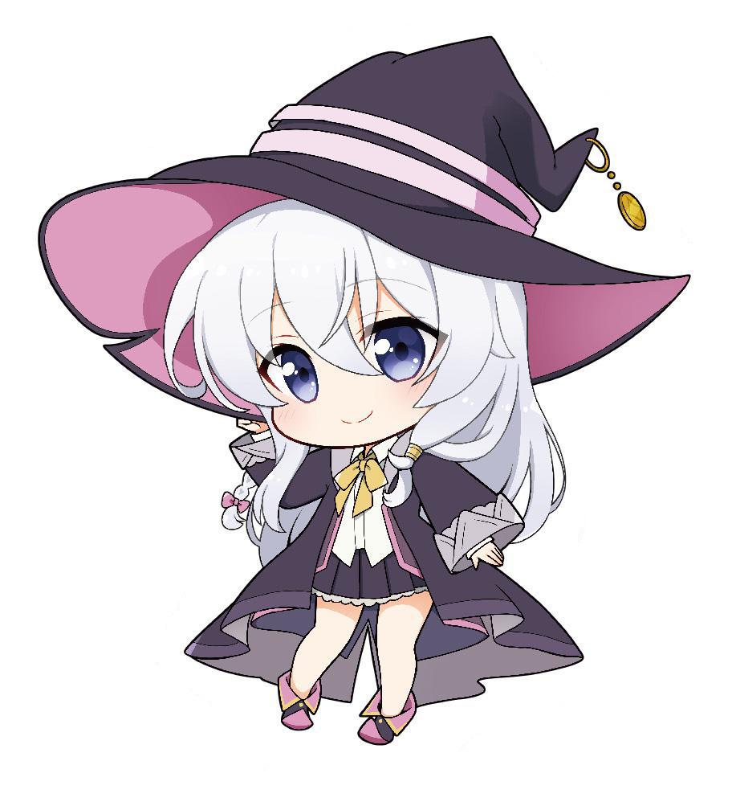
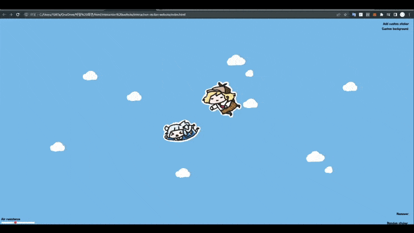

# interaction-sticker-website

  

  

### 스티커 인터렉션 웹사이트

대부분의 기능은 Javascript로 제작되었음

#

스팀(steam)에서 판매중인 Wallpapaer engine을 사용해, 바탕화면의 배경을 꾸밀 수 있음

#### ▼ 관련해선 요기 참고

(추가 예정)

우측 버튼들을 통해, 랜덤 스티커를 붙일 수 있으며, 배경 커스터마이징 및 커스텀 스티커 또한 붙일 수 있음

### ▼ 미리보기

#

### ▼ 그 이외

#### ▼ 랜덤 스티커 이미지
https://twitter.com/blue00f4/status/1551887529615687680
https://twitter.com/7naaka/status/1448964364325720070?t=AgLGQ2IVrUxrdts5m8cKug&s=19
https://www.1999.co.jp/eng/image/10806377/30/1
